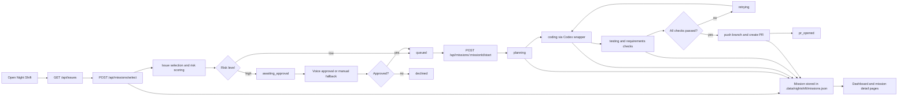

# Night Shift

Night Shift is a Codex-powered autonomous development MVP focused on a single GitHub repository. It selects an issue, requests approval when needed, runs implementation work, and aims to finish with a pull request.

The current implementation includes a Next.js monitoring UI and API layer, local persistence, GitHub issue fetching, risk scoring, an approval gate, runner execution, and check/result visibility.

## What It Does

- Fetches open issues from one configured repository
- Selects one issue and generates a summary, acceptance criteria, and risk level
- Sends high-risk missions through a voice approval flow
- Auto-starts low-risk missions
- Tracks mission state, events, checks, branch, and PR URL in the UI
- Attempts branch creation, Codex execution, lint/test/requirements checks, and PR creation on a local clone

## Tech Stack

- Next.js 16 App Router
- React 19
- TypeScript
- Tailwind CSS v4
- GitHub REST API
- Bland AI (optional, for voice approval)
- Codex CLI / OMX scripts
- Local JSON storage

## Architecture Overview

- `frontend/`
  Main Next.js app. Contains the dashboard, mission detail pages, and API routes.
- `frontend/src/lib/nightshift/`
  Mission / MissionEvent / CheckResult types and the local store implementation.
- `frontend/lib/`
  GitHub fetching, issue selection, voice approval, git operations, checks, and the Codex execution wrapper.
- `scripts/`
  Supervisor scripts for OMX-based execution.
- `SPEC.md`
  MVP product and system specification.
- `task.yml`
  Task breakdown and progress notes.

## Flow



## Mission States

The main mission states currently implemented are:

- `candidate_selected`
- `awaiting_approval`
- `queued`
- `planning`
- `coding`
- `testing`
- `retrying`
- `pr_opened`
- `failed`
- `canceled`
- `declined`

## Main Screens

- `/`
  Shows the live issue list, the current mission, and recent missions.
- `/missions/[missionId]`
  Shows selection rationale, approval state, events, checks, diff, and PR information.
- `/overview`
  Shows the overview page.

## Main API Endpoints

- `GET /api/issues`
  Returns open issues for the configured repository.
- `POST /api/missions/select`
  Selects an issue, creates a mission, and routes it into approval if needed.
- `POST /api/missions/:missionId/start`
  Starts a mission in the `queued` state.
- `POST /api/missions/:missionId/approve`
  Approves a high-risk mission.
- `POST /api/missions/:missionId/decline`
  Declines a high-risk mission.
- `POST /api/webhooks/bland`
  Webhook entrypoint for voice approval.

## Data Locations

- Mission store
  `.data/nightshift/missions.json`
- Cloned target repository
  `.data/repos/<owner>_<repo>`
- OMX logs
  `.omx/logs/`
- OMX checkpoints
  `.omx/checkpoints/`

## Setup

### 1. Install dependencies

```bash
cd frontend
npm install
```

### 2. Configure environment variables

At minimum, point the app at the target repository:

```bash
export GITHUB_REPO_OWNER=ys
export GITHUB_REPO_NAME=NightShift
```

Optional variables:

```bash
export GITHUB_TOKEN=...
export BLAND_API_KEY=...
export BLAND_PHONE_NUMBER=...
export NEXT_PUBLIC_BASE_URL=http://localhost:3000
export BRANCH_PREFIX=nightshift/
export MAX_RETRIES=3
```

Without `GITHUB_TOKEN`, parts of the GitHub API flow and PR creation are limited. Without `BLAND_API_KEY` or a phone number, voice approval falls back to a structured log trigger.

### 3. Start the development server

```bash
cd frontend
npm run dev
```

Open `http://localhost:3000` in the browser.

## OMX Execution Scripts

For longer autonomous runs, use the supervisor script in `scripts/`:

```bash
scripts/run-nightshift-omx-supervisor.sh
```

Main responsibilities:

- Creates a safe working branch
- Repeatedly runs `scripts/omx-main-script.sh`
- Stores lint/build preflight and postflight results
- Writes run artifacts to `.omx/logs/` and `.omx/checkpoints/`

## Verification

```bash
cd frontend
npm run lint
npm run build
```

## Current Constraints

- Single repository only
- One active mission at a time
- Stops at PR creation, not merge
- Uses a local JSON store for MVP persistence
- Approval and Codex execution include simulation or fallback behavior when full external configuration is not available

## References

- `SPEC.md`
- `task.yml`
- `frontend/README.md`
